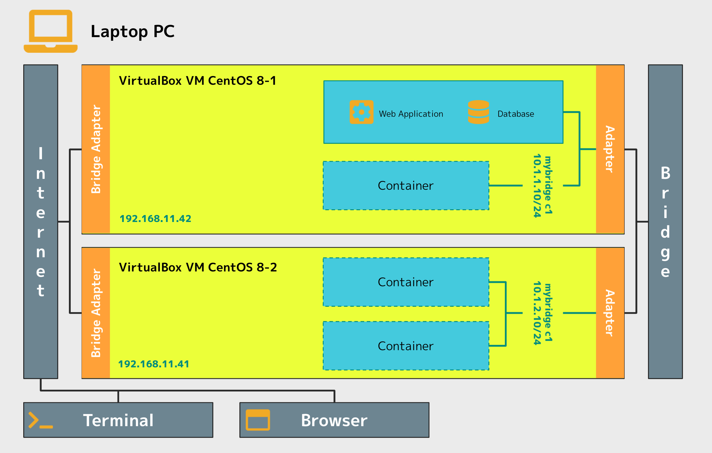

# クラウドインフラ構築特論

Web service name: `infra-control`

## Infra Control System Design

## Instance state

| ID  | State        |
| --- | ------------ |
| 1   | Starting     |
| 2   | Initializing |
| 3   | Running      |
| 4   | Terminating  |
| 5   | Terminated   |
